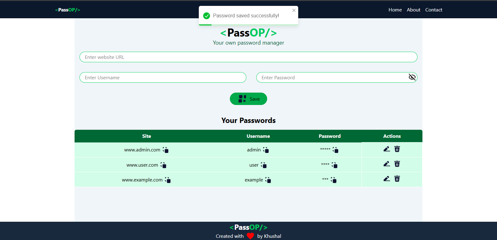

# PassOP - Password Manager

PassOP is a secure and user-friendly password manager built with **React**, **Tailwind CSS**, **Node.js**, and **MongoDB**.  
It allows users to safely store, manage, and retrieve their credentials for multiple websites in one place.

## Features
- Add, edit, and delete saved passwords
- Copy credentials (site, username, password) with one click
- Hide/Show passwords for better security
- Responsive UI with Tailwind CSS
- Backend built with Node.js and Express.js
- MongoDB database for persistent storage
- Clean and modern design

## Technologies Used
- **Frontend:** React.js, Tailwind CSS
- **Backend:** Node.js, Express.js
- **Database:** MongoDB

## Installation

1. Clone the repository:
   ```bash
   git clone https://github.com/your-username/passop.git
   cd passop
   ```

2. Install dependencies for both frontend and backend:
   ```bash
   cd client
   npm install
   cd ../server
   npm install
   ```

3. Setup environment variables in `.env` file (in `server` folder):
   ```env
   MONGO_URI=your_mongodb_connection_string
   PORT=5000
   ```

4. Start the backend server:
   ```bash
   cd server
   npm start
   ```

5. Start the frontend React app:
   ```bash
   cd client
   npm start
   ```

## Screenshot



---

### Future Improvements
- Add user authentication (Login/Signup)
- Enable password encryption for extra security
- Add password generator feature
- Deploy to cloud (Vercel/Netlify for frontend, Render/Heroku for backend)

